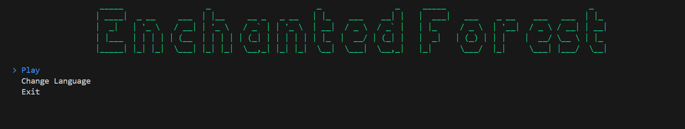
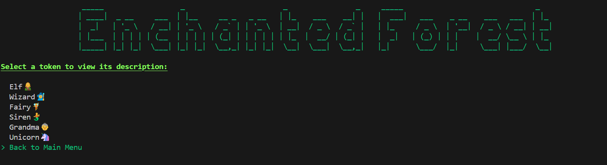
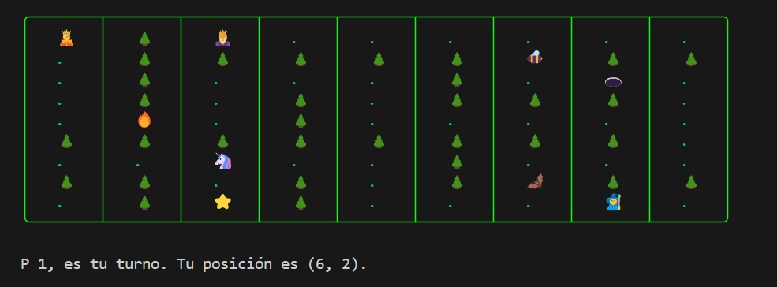

# Enchanted Forest´s Maze 

## 🎮 Description 🎮
Once upon a time, the beautiful and peaceful forest of Sylvaria was cursed by an evil entity, transforming it into a dark, magical maze with dangerous traps. Players must navigate this maze, compete against each other, and find the exit—a shining star that promises freedom. Along the way, you'll encounter traps that will harm you, magical cells to aid you, and a random teleportation spot that could either help or hinder your progress.

While navigating the maze, you must outwit your opponent and deal with traps, the other player´s abilities, and unexpected twists. But beware—only one player can escape, so you must hurry before your rival gets the upper hand!

The king and queen are trapped inside the maze too and will offer assistance when you cross their paths. But be careful of the invisible area that teleports you to a random spot in the maze. Will you make it to the exit first, or will you fall victim to the maze's cruel tricks?

Good luck, and may the best player win!

## 🎄 Features 🎄
- Option to choose between playing in Spanish or English for a fully customizable language experience. 
- Two-player gameplay.
- Various tokens, each with unique abilities, speed, and cooldown time.
- Traps that can alter the course of the game.
- A randomly generated maze for each playthrough.
- Customizable maze size, allowing you to choose the difficulty.
- Beneficial cells that provide helpful effects: speed boosts and cooldown reductions.
- A teleportation cell that randomly transports players to different positions in the maze.

## 📜 How to Play 📜
1. Select your language (Spanish or English).
2. Input the size of the maze (customizable to your preference).
3. Choose one token per player(Elf, Wizard, Siren, etc.).
4. Navigate through the maze using the arrow keys.
5. Decide whether to use your token’s ability on each turn, taking into account your cooldown time.
6. Be cautious of traps that may affect your progress.
7. The first player to reach the exit wins.
8. After a win, choose whether to play again. The game will restart with the same language as before.

## 📸 Pictures 📸
• Language of the game depending on the user input:

• List of all tokens available together with their descriptions:

• Generated maze based on user´s desired size:

## 🪄 Initial Setup 🪄 
1. Clone this repository.
2. Install .NET SDK if it's not already installed. You can download it from the official Microsoft website. This project uses .NET 8.0.
3. Install the Spectre.Console library for the terminal interface. Run the following command in your terminal "dotnet add package Spectre.Console --version 0.49.1"
4. For language switching features ensure that you have the .NET Resources package for resource management: "dotnet add package System.Resources.Extensions --version 9.0.0"
5. Open the project in your preferred IDE (Integrated Development Environment).
6. Run the project.

## 🔧 Built With 🔧 
- C#
- Spectre.Console
- .NET Resource Management

## 🙏 Recognition 🙏
Special thanks to my professors and the teacher assistants at The University of Havana for their support. This project marks the first programming assignment in my first semester as a Computer Science major. The game idea, design and development was an exciting introduction to programming concepts, different frameworks, and creativity.

## 📩 Contact Info 📩
- Author: Meylí
- Email: [meylijv@gmail.com]
- GitHub: [https://github.com/MenwaLab]